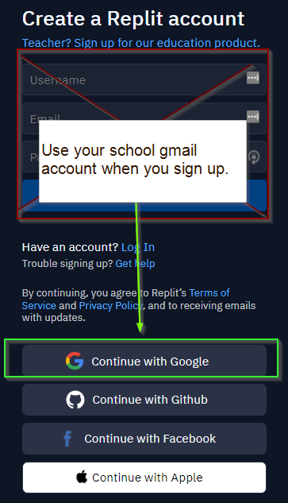

# Class Software

## Replit

For the majority of this class, we will use the coding platform [Replit].

> [Replit] is a platform for creating and sharing software. You can write your
> code and host it all in the same place. [Replit] is also a place to learn how to
> code!

If you do not already have a [Replit] account, you should sign up for one here:
[LINK](https://replit.com/signup)

{: .warning }
Be sure you sign up using your school email account. Doing so gives you access
to the schools paid account tools.

# What's Next

Once you have a [Replit] account, you're ready to create your very first Web
Project! You should proceed to [1. A Simple Web Page] to learn how to create an
Web Project using [Replit].

