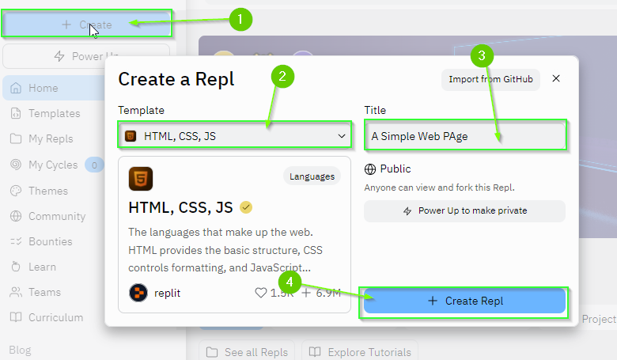
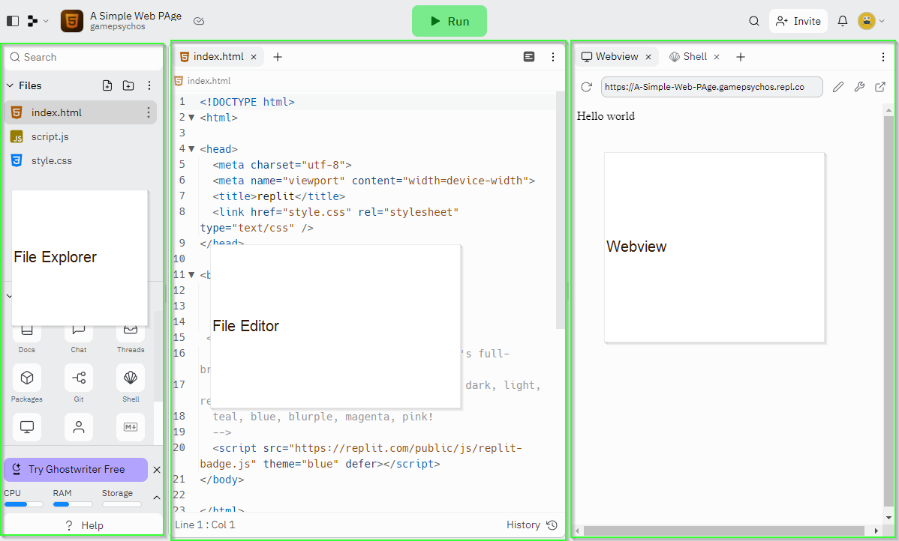

# 1.1 Creating a new Replit Project
{: .no_toc }


<details open markdown="block">
  <summary>
    Table of contents
  </summary>
  {: .text-delta }
1. TOC
{:toc}
</details>

# Creating a Replit Project

[Replit] provides templates for creating projects in dozens of different
programming languages. For the most part, the web runs on 3 different languages,
HTML, CSS, and JavaScript. To start out, you will create a project that uses
these 3 languages:

1. Log into your [Replit] account
2. In the top left corner, click the `+ Create` button
3. From the template drop down, search for `HTML, CSS, JS`
4. Name your project `A Simple Web Page`
5. Click the `Create Repl` button



# Navigating Replit's Interface

By default, Replit's interface is divided into 3 columns. 

* The first column is the `File Explorer`
  * This is where all of your project files will go. You can drag and drop files
    from your computer to upload them here. Additionally, you can create new
    files and folders directly in the `File Explorer` here.
* The second column is the `File Editor`
  * This is where you will spend the majority of your time working. When you
    select a file from the `File Explorer` its contents will be displayed here.
* The third column is the `Webview`
  * When you run the project, this is where the result will be displayed.



# What is HTML?

You may have heard the term HTML in the past when talking about the web. But,
what is HTML? The acronym stands for [HyperText Markup Language]. But... what
does **THAT** mean?

Essentially, it is saying that an HTML file is a **text** file where the text is
**HYPER**! No... no... In this context the word **Hyper** just means **text**
that has **more** than regular text. In this case, the text has additional
meaning compared to traditional plain text.

{: .note }
99% of all web sites you have ever visited send HTML to your computer and your
web browser translates that HTML into the images you see on the screen.

# Challenge: Changing the HyperText

Take a look at the `index.html` file. Then, look at the `WebView`. Can you
modify the source code of the `index.html` file such that your name is displayed
in the `WebView`?

If things stop working, you can replace the entire contents of the `index.html` file with the
original code which can be found below:

<details markdown="block">
  <summary>
    Original index.html file (Click to Open)
  </summary>

```html
<!DOCTYPE html>
<html>

<head>
  <meta charset="utf-8">
  <meta name="viewport" content="width=device-width">
  <title>replit</title>
  <link href="style.css" rel="stylesheet" type="text/css" />
</head>

<body>
  Hello world
  <script src="script.js"></script>

 <!--
  This script places a badge on your repl's full-browser view back to your repl's cover
  page. Try various colors for the theme: dark, light, red, orange, yellow, lime, green,
  teal, blue, blurple, magenta, pink!
  -->
  <script src="https://replit.com/public/js/replit-badge.js" theme="blue" defer></script> 
</body>

</html>

```
</details>

# What's Next

If you attempted to modify the HTML file further, you may have found it was
difficult (or impossible) to format the text you added on the screen. In the
next section [1.2. Creating the World's Best Web Page], you will learn more
about the structure of HTML and how to use **tags** to specify what content to
display on the screen.

