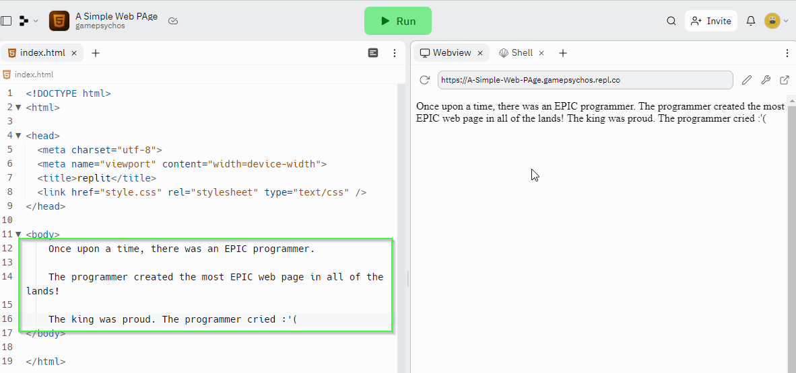

# 1.2 Creating the World's Worst Web Page
{:.no_toc}

<details open markdown="block">
  <summary>
    Table of contents
  </summary>
  {: .text-delta }
1. TOC
{:toc}
</details>

# What is a Tag?

Before you start modifying more of the `index.html` page, it is useful to
understand how HTML is structured.

Look at the `index.html` file. You will likely notice there are quite a few
words that appear between angle brackets (`<` and `>`). In HTML, this is called
a **tag**. For example, at the top of the file you will find an `html` **tag**:

```html
<html>
```

Then at the very bottom of the `index.html` file, you will find a **closing**
`html` **tag**:

```html
</html>
```

Everything between the opening (`<tag-name>`) and closing (`</tag-name>`)
**tags** are called the **body** of the **tag**. For example, the `title`
**tag** is written this way:

```html
<title>replit</title>
```

In the above example, you would say that the **body** of the `title` **tag** is
"replit".

# What is an Attribute

Often, you will see a **tag** that contains several words within. Only the
**first** word is the name of the **tag**. For example, the **tag** below 
is a `meta` **tag**:

```html
<meta charset="utf-8">
```

The rest of the text describes an **attribute**. In the above example, the
`meta` **tag** has the `charset` **attribute**. Additionally, the `charset`
**attibute** has a value "utf-8".

A **tag** may have any number of **attributes**. For example:

```html
<link href="style.css" rel="stylesheet" type="text/css" />
```

In the code above, you would say that the `<link>` **tag** has 3 **attributes**:
`href`, `rel`, and `type`.

# Self-closing Tags

In general, each **opening tag** (`<tag-name>`) must eventually define a
**closing tag** (`</tag-name>`). However, you may have noticed some tags like
the `<meta>` and `<link>` **tags** do not define a closing **tag**. These
**tags**, and a few others like them are called **self-closing tags** and break
the rule for requiring a **closing tag**.


# Challenge: Identifying Tags

For each of the following **tags**, identify the **name**, **attributes**,
**attribute values**, and **body**.

## Div Tag

```html
<div id="content">Hello, world!</div>
```

* What is the **name** of the **tag** in the above code?
* Which **attributes** does the **tag** above have?
* What are the **values** of the **attributes**?
* What is the **body** of the **tag**?

## Img Tag

```html

```

* What is the **name** of the **tag** in the above code?
* Which **attributes** does the **tag** above have?
* What are the **values** of the **attributes**?
* What is the **body** of the **tag**?

# Nesting Tags
You may have noticed that the `<head>` **tag**'s **body** contains several other
tags:

```html
<head>
  <meta charset="utf-8">
  <meta name="viewport" content="width=device-width">
  <title>replit</title>
  <link href="style.css" rel="stylesheet" type="text/css" />
</head>
```

When a **tag**'s **body** contains additional **tag**'s, we say that they are
**nested**. In the example above, you would say that the `<meta>`, `<title>`,
and `<link>` **tags** are **nested** inside the `<head> **tag**.

# The <body> tag

With a basic understanding of the anatomy of **tags** within an HTML document,
let's move our attention to the `<body>` **tag**.

The `<body>` **tag** defines the **content** that should be displayed to the
user. By default, the `index.html` file's `<body>` tag looked like this:

```html
<body>
  Hello world
  <script src="script.js"></script>

 <!--
  This script places a badge on your repl's full-browser view back to your repl's cover
  page. Try various colors for the theme: dark, light, red, orange, yellow, lime, green,
  teal, blue, blurple, magenta, pink!
  -->
  <script src="https://replit.com/public/js/replit-badge.js" theme="blue" defer></script> 
</body>
```
 Everything **within** the `<body>` tag is rendered by the web browser to the
 screen. **HOWEVER**, you may have noticed that the only text "Hello world"
 actually appears on the page. There are two reasons for this:

 1. The `<script>` **tag** is an "empty" element that results in nothing being
    displayed
 2. the `<!-->` **tag** is a "comment" element that, just like the `<script>`
    **tag** is an "empty" element that results in nothing being displayed.

That said, you can safely delete them from the `index.html`.

* Update your `<body>` tag to contain only "Hello world":

```html
<body>
  Hello world
</body>
```

If you click the `> Run` button, you will see that the page displays exactly as
it did before!

# The <p> tag

Alright, so you want to add some additional text to your web page. You've
beautifully crafted an epic story and can't wait to share it! You copy and paste
it into your web page's `<body>` **tag** and click `> Run`:

```html
<body>
    Once upon a time, there was an EPIC programmer.

    The programmer created the most EPIC web page in all of the lands!

    The king was proud. The programmer cried :'(
</body>
```

And... the outcome is one giant pile of unformatted text:



## What's happening?
{:.no_toc} 

It turns out in HTML, repeating whitespace is ignored. This results in all of
the text running together on the page. So, how do you space text?

Enter the `<p>` **tag**. The `p` stands for "paragraph" and tells the browser
that you would like to add a paragraph element to the content of the page.

For example:

```html
<body>
  <p>
    Once upon a time, there was an EPIC programmer.
  </p>
  <p>
    The programmer created the most EPIC web page in all of the lands!
  </p>
  <p>
    The king was proud. The programmer cried :'(
  </p>
</body>
```

In the code above, the `<body>` **tag** contains 3 paragraphs (`<p>` **tags**).
This results in a **slightly** nicer outcome:


# Header Tags

There are 6 header **tags** available within HTML: `<h1>`, `<h2>`, `<h3>`,
`<h4>`, `<h5>`, and `<h6>`.

These these **tags** work similar to the `<p>` **tag** by rendering their **body** to the web page.
However, by default, they also have slightly different default styling from each other. Give it a
try!

1. Update your `<body>`  to contain one of each of the headers.

The code below shows how to use the `<h1>` **tag**:

```html
<body>
    <h1>An Epic Tale</h1>
  <p>
    Once upon a time, there was an EPIC programmer.
  </p>
  <p>
    The programmer created the most EPIC web page in all of the lands!
  </p>
  <p>
    The king was proud. The programmer cried :'(
  </p>
</body>
```

# Challenge: Read the Friendly Manual Img Tag

There are over 100 different HTML tags! That is far more than could possible be
covered in a single class. Lucky for you, you don't need to have all of them
memorized. A much better strategy is to know **WHERE** to find them. In this case,
you can use the Read the Friendly Manual!

To add images to an HTML page, you can use the `` **tag**. In this challenge,
you should read the manual page (and google if necessary) and add an image to your
web page.

[The Image Embed element](https://developer.mozilla.org/en-US/docs/Web/HTML/Element/img)

# What's Next

In this chapter, you learned that HTML documents are comprised of **tags** which
describe **what** should be on the page. However, a **tag** by itself does not
describe **how** the element should be displayed on the screen.

In [1.3. Basic HTML Styling] you will learn how to tell the web browser **how**
the elements **should** be displayed on the screen.
