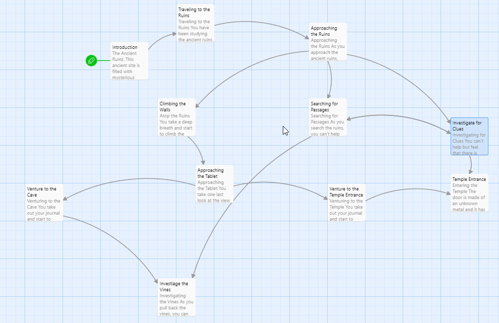

# Create Your Own Adventure

Before starting this project, be sure to check out chapter [3.1 - Ancient Ruins
Example Adventure] to see an HTML Adventure

# The Task

Use everything you've learned so far to create your own HTML Adventure!

## Requirements

* Your adventure must have **at least** 10 different HTML pages (you may have more)
* Your `index.html` page is the first page of your adventure. It should provide
  a description of your adventure as well as an author line. You may use a
  [pseudonym or alias](https://en.wikipedia.org/wiki/Pseudonym) as your author name.
* Each page should include a title (you may use any header you like)
* Each page should include a description of events occurring in the adventure. (At least 3 sentences per page)
* At least 5 of your pages must have 2 or more options

# 1. Create an Adventure Map

Before starting, draw out a sketch of your adventure on paper. Draw arrows
between each of your pages to help keep track of the possible options the reader
may take. This will be your adventure map!

For example, here is the map of the Ancient Ruins Adventure:

Take a picture of your adventure map and submit it on Google Classroom.

# 2. Create a Replit Outline

Next, create a Replit project for your adventure. Within the Replit project:

1. Create an HTML page for each of the pages on your map.
2. Update each HTML page to contain a short description for that page
3. Update each HTML page to contain anchor tags that link to the appropriate pages

Submit a Link to your outline on Google Classroom

# 3. Adding Depth and Style to the Story

Now that you have an outline of your HTML Adventure, it is time to
fill in the details.

1. On each page, update the style to your liking.
2. Add depth to your story by writing a narrative for each page.
3. Find, create, or generate an image for pages.

Here are 2 tools that use AI to generate art:

* [Night Cafe](https://creator.nightcafe.studio/) - 28 free generations per day
* [Fotor](https://www.fotor.com/features/ai-image-generator/) - Free but you have to sign up

If you search for "AI Art Generation", you may be able to find additional tools.

When you have finished your adventure, submit a link to it on Google Classroom

